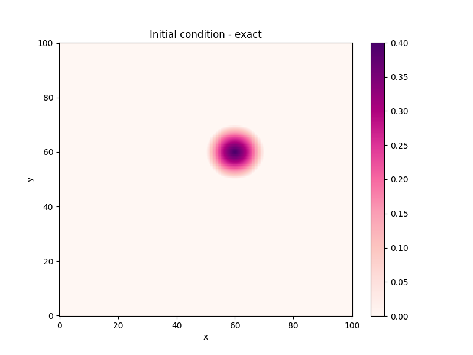
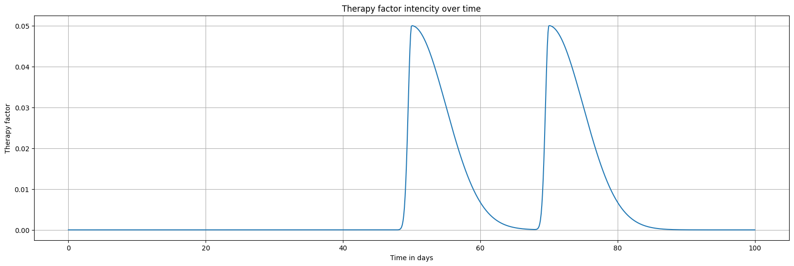
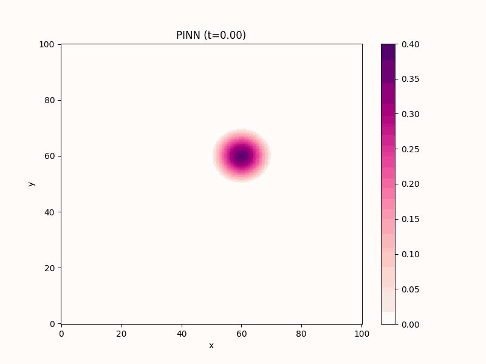
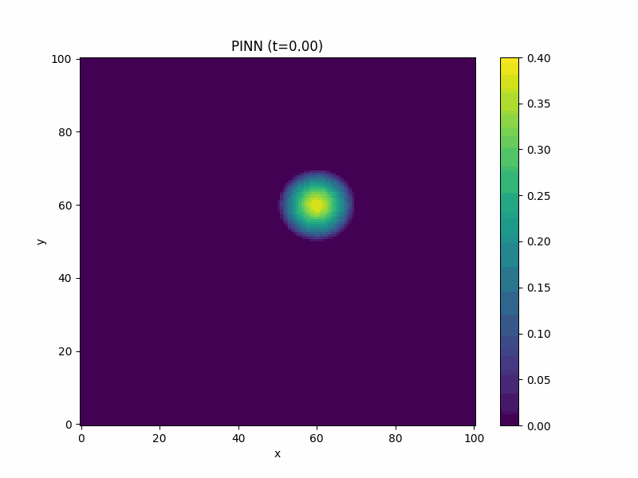
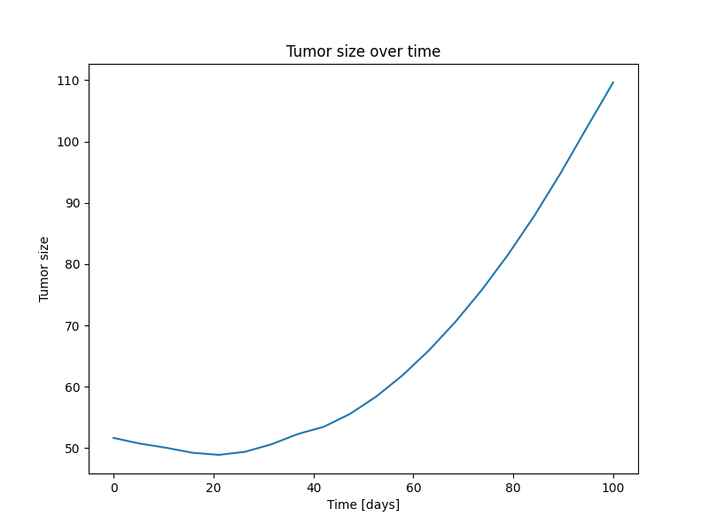
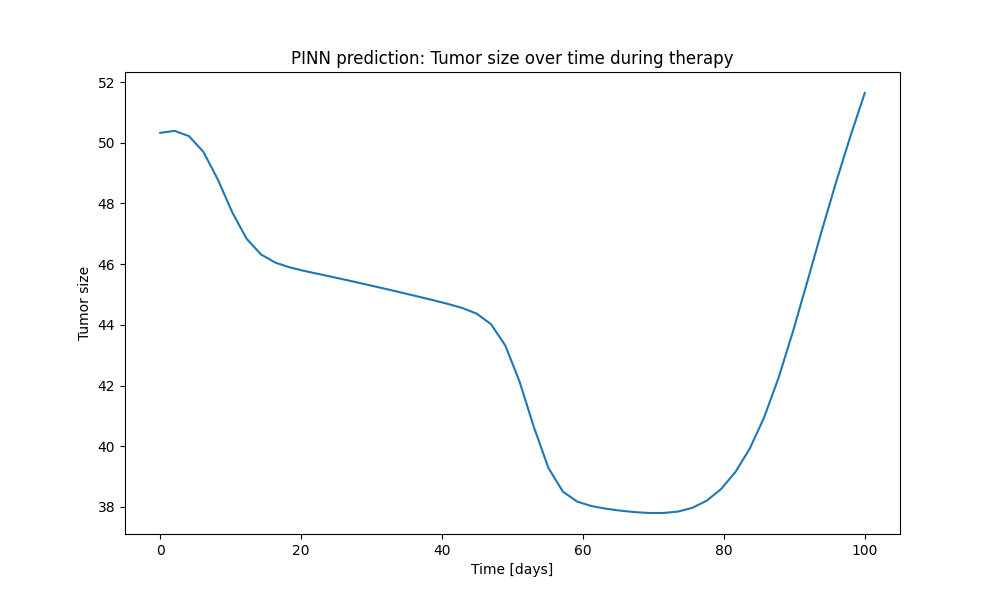

# PINN approximation of brain tumor growth and therapy

PDE equation used in PINN's loss function is as follows:

$$\frac{\partial u}{\partial t} = \nabla \cdot [D(\mathbf{x}) \nabla u] + \rho u  (1-u) - R(t)u \textrm{ in } \Omega$$

Initial condition was given using quadratic function.

Therapy factor indicates what fraction of tumor cells die per day. Chart below presents its value over simulation tine. 

Therapy indeed makes difference to simulated tumor size. Animations below show giloma growth without therapy and with it. 

|No therapy||
|---|---|
|Therapy||

Below there are charts of tumor size over time calculated as finite integral in space domain of the tumor concentration function. 

|No therapy||
|---|---|
|Therapy||
